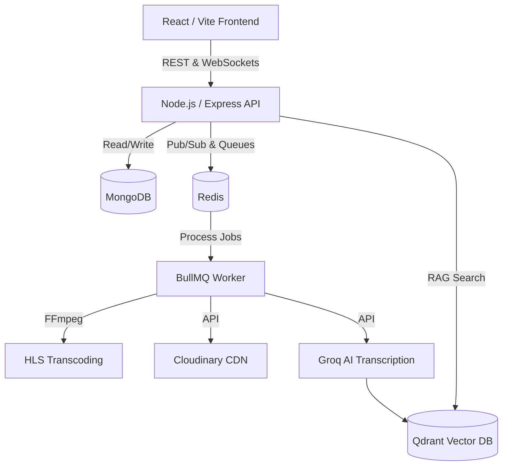

<div align="center">
  
  
  # Vidora Video Tube 🎬

  **A Next-Generation, AI-Powered Video Streaming Platform**

  [](#)
  [](#)
  [](#)
  [](#)
  [](#)
</div>

---

Vidora is a production-grade, highly scalable video streaming platform engineered with the MERN stack. It goes beyond standard video hosting by integrating advanced **Artificial Intelligence**, **Real-Time Collaboration**, and **Adaptive Bitrate Streaming (HLS)** to deliver an unparalleled user experience.

Designed with system design best practices, the platform features robust background workers, vector-based semantic search, and secure, rate-limited APIs.

## ✨ Key Features

- **Adaptive HLS Streaming:** Automatically transcodes user uploads into multiple resolutions (1080p, 720p, 480p) using `FFmpeg` for seamless playback on any network condition.
- **AI Video Intelligence:** Integrates with `Groq Whisper Large V3` for automated video transcription, and utilizes Large Language Models to power the interactive **AI Video Tutor**.
- **Vector Search & RAG:** Generates embedding vectors from video transcripts and stores them in `Qdrant` for semantic search and AI-driven "Skill Tree" curriculum generation.
- **Real-Time Watch Parties:** Utilizes `Socket.IO` and Redis Pub/Sub to allow users to watch videos completely synchronized with friends, complete with live chat.
- **Enterprise-Grade Security:** Fortified with JWT rotation, Helmet security headers, Zod input validation, strict CORS, and robust endpoint rate-limiting.
- **Asynchronous Background Processing:** Uses `BullMQ` and `Redis` to queue heavy compute tasks (transcoding, AI processing, thumbnail generation) without blocking the main event loop.

## 🏗️ System Architecture



## 🛠️ Technology Stack

| Category | Technologies |
|----------|--------------|
| **Frontend** | React 18, Vite, Tailwind CSS, Framer Motion, Zustand |
| **Backend** | Node.js, Express, Socket.IO, BullMQ, Mongoose |
| **Databases** | MongoDB Atlas, Redis Cloud, Qdrant (Vector DB) |
| **Media / Storage**| FFmpeg, Cloudinary, HLS.js |
| **AI / NLP** | Groq (Whisper V3, Llama 3), LangChain |

---

## 🚀 Quick Start Guide

### 1. Prerequisites
- **Node.js** (v18 or higher)
- **MongoDB Atlas** connection string
- **Redis** instance (local or Redis Cloud)
- **Cloudinary** account credentials

### 2. Installation

Clone the repository and install dependencies for both services:

```bash
git clone https://github.com/your-username/Vidora-Video-Tube.git
cd Vidora-Video-Tube

# Install Backend dependencies
cd Vidora-backend
npm install

# Install Frontend dependencies
cd ../vidora-frontend
npm install
```

### 3. Environment Configuration

Navigate to the `Vidora-backend` directory and create a `.env` file based on the template:

```bash
cp .env.example .env
```

<details>
<summary><b>Click to view required environment variables</b></summary>

```env
PORT=8000
NODE_ENV=development
CORS_ORIGIN=http://localhost:5173

MONGODB_URI=mongodb+srv://<user>:<password>@cluster.mongodb.net/vidora
REDIS_HOST=localhost
REDIS_PORT=6379

ACCESS_TOKEN_SECRET=your_super_secret_access_key
ACCESS_TOKEN_EXPIRY=15m
REFRESH_TOKEN_SECRET=your_super_secret_refresh_key
REFRESH_TOKEN_EXPIRY=7d

CLOUDINARY_CLOUD_NAME=your_cloud_name
CLOUDINARY_API_KEY=your_api_key
CLOUDINARY_API_SECRET=your_api_secret

GROQ_API_KEY=your_groq_key
QDRANT_URL=your_qdrant_url
QDRANT_API_KEY=your_qdrant_key
```
</details>

### 4. Running Locally

Vidora utilizes a unified development environment. Run the following commands in separate terminal instances:

```bash
# Terminal 1: Start the Backend API & Workers
cd Vidora-backend
npm run dev

# Terminal 2: Start the React Frontend
cd vidora-frontend
npm run dev
```

Visit `http://localhost:5173` to explore the platform.

---

## 🛡️ Security Posture

Vidora is built with a defense-in-depth approach to ensure platform integrity and user safety:

- **Data Validation:** All incoming HTTP requests are strictly typed and validated using **Zod** schema parsers before reaching the controllers.
- **Authentication:** Stateless authentication utilizing short-lived access tokens (15m) alongside securely rotated refresh tokens stored in `httpOnly`, `sameSite=strict` cookies.
- **Rate Limiting:** IP-based throttling on authentication and heavy I/O endpoints (video uploads) to prevent brute-force and DoS attacks.
- **Resource Protection:** File uploads are intercepted by **Multer**, restricting mimetypes and enforcing payload limits (100MB) before stream processing.

## 📈 Scalability Considerations

- The Node.js API is fully stateless, allowing horizontal scaling across multiple instances or containers.
- Heavy computational tasks (FFmpeg) are intentionally decoupled via **BullMQ**. In a production environment, workers can be deployed to dedicated, compute-optimized instances separate from the main API servers.
- Media delivery is fully offloaded to **Cloudinary's CDN**, ensuring rapid content delivery with minimal origin server bandwidth consumption.

---
<div align="center">
  <i>Engineered for Performance, Scalability, and Intelligence.</i>
</div>
