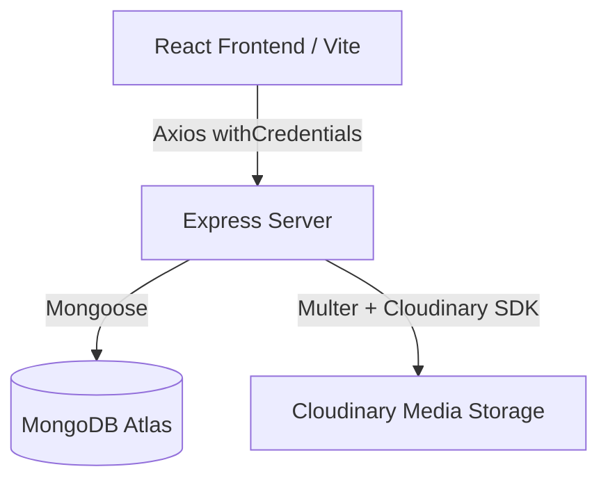

# Vidora Video Tube - Project Summary

Vidora Video Tube is a full-stack, production-grade video sharing application similar to YouTube. It features a complete Node.js/Express REST API backend with MongoDB, and a React SPA frontend styled with Tailwind CSS.

---

## 🏗️ System Architecture

### 1. Backend Stack (`Vidora-backend`)
- **Core Runtime & Framework**: Node.js & Express.js (ES Modules syntax).
- **Database**: MongoDB using Mongoose ODM.
- **File Processing**: Multer middleware for parsing multipart/form-data and handling local file caching.
- **Cloud Media Storage**: Cloudinary SDK for storage, management, and retrieval of videos, avatars, and cover images.
- **Authentication**: JWT (JSON Web Tokens) with access and refresh token rotation, stored securely using `cookie-parser`.
- **Security & Utilities**: `bcrypt` for password hashing, `cors` for managing cross-origin requests, custom API wrappers (`ApiError`, `ApiResponse`, and `asyncHandler`).

### 2. Frontend Stack (`vidora-frontend`)
- **Build Tool**: Vite (React + Javascript).
- **Styling**: Tailwind CSS with custom theme variables.
- **Routing**: React Router DOM (v6) with client-side routes and route guards (`ProtectedRoute`).
- **Animations**: Framer Motion for smooth transitions and hover states.
- **State Management**: React Context (`AuthContext`) for tracking authentication status and user details.
- **HTTP Client**: Axios with interceptors, configured via custom `axiosInstance` supporting `withCredentials` for session/cookie verification.

---

## 📁 Project Directory Structure & Key Files

### Backend: `Vidora-backend/`

| Path | Purpose | Key Responsibilities |
| :--- | :--- | :--- |
| `src/index.js` | Server entry point | Connects to MongoDB, configures port, and boots the Express server. |
| `src/app.js` | Express setup | Registers global middlewares (CORS, JSON limits, Cookie parser, Static folders) and defines API version routes. |
| `src/constants.js` | Global constants | Stores application constants (e.g., database names). |
| **`src/db/`** | Database configurations | |
| `src/db/index.js` | DB connection helper | Connects the application to the MongoDB Atlas cluster. |
| **`src/models/`** | Mongoose database schemas | |
| `user.model.js` | User Schema | Houses fields for username, email, full name, avatar, cover image, password (hashed), watch history, and JWT generation methods (`generateAccessToken`, `generateRefreshToken`). |
| `video.model.js` | Video Schema | Manages video files, thumbnails, title, description, duration, view count, publish status, and references user/owner. Uses `mongoose-aggregate-paginate-v2`. |
| `comment.model.js` | Comment Schema | Tracks video comment threads, references to commenters, and associated videos. Uses pagination. |
| `like.model.js` | Like Schema | Stores likes for videos, comments, and tweets. |
| `playlist.model.js` | Playlist Schema | Stores curated groups of videos created by users. |
| `subscription.model.js` | Subscriber Schema | Maps many-to-many subscriber relations (`subscriber` to `channel`). |
| `tweet.model.js` | Tweet Schema | Simple micro-posting model for user channel feeds. |
| **`src/controllers/`** | Express route handlers (API logic) | Contains matching controllers for comments, dashboard stats, server healthchecks, likes, playlists, subscriptions, tweets, users, and video upload/processing. |
| **`src/routes/`** | Express Router mappings | Exposes endpoints under `/api/v1/...` for each of the core models (e.g. `user.routes.js`, `video.routes.js`). |
| **`src/middlewares/`** | Express middlewares | |
| `auth.middleware.js` | Authentication gate | Decodes and validates JWT from cookies or headers, attaching the authenticated user object to the request. |
| `multer.middleware.js` | Disk file upload helper | Intercepts multipart/form-data upload fields and caches them locally inside the `public/temp` folder. |
| **`src/utils/`** | Utility modules | |
| `ApiError.js` | Custom Error wrapper | Formats errors uniformly with stack traces, HTTP status codes, and success boolean flags. |
| `ApiResponse.js` | Custom Response wrapper | Formats HTTP responses uniformly with data, status code, and messaging. |
| `asyncHandler.js` | Promise wrapper | Standardizes try/catch error handling in controllers to avoid repetitive code block declarations. |
| `cloudinary.js` | Cloud Storage uploader | Receives local file paths, uploads them asynchronously to Cloudinary, handles upload success, and cleans up local temporary files. |

---

### Frontend: `vidora-frontend/`

| Path | Purpose | Key Responsibilities |
| :--- | :--- | :--- |
| `src/main.jsx` | App Bootstrap | Mounts the root React DOM node, sets up the router context. |
| `src/App.jsx` | Layout & Routing | Mounts layout elements (`SideNav`, `Navbar`, page animations) and defines application routes. |
| `src/index.css` | Global styles | Holds Tailwind imports and basic CSS rules. |
| **`src/api/`** | Backend API connection | |
| `axiosInstance.js` | Central Axios setup | Configures `baseURL` (resolves between dev `localhost:8000` and config envs) and sets `withCredentials: true`. |
| `auth.js`, `videos.js`, etc. | Endpoint functions | Abstracts API requests (e.g., `loginUser`, `uploadVideo`, `addComment`) away from frontend UI components. |
| **`src/context/`** | React Context state | |
| `AuthContext.jsx` | Authentication state | Shares `currentUser`, `loading`, `login`, and `logout` states globally across all components. |
| **`src/components/`** | Reusable UI components | Includes layout parts (`Navbar`, `SideNav`, `Sidebar`), utility wrappers (`ProtectedRoute`, `ToastProvider`), loaders (`Loading`, `SkeletonGrid`), and feature elements (`VideoCard`, `PlayerWrapper` for custom players, `UploadForm`, `RecommendedVideos`). |
| **`src/pages/`** | Route views | Contains structural page views: `Home` (video grid), `Explore`, `SearchResults` (queried videos), `Profile` (user statistics, uploads, subscriber count), `VideoPage` (player, comments, likes, subscriptions), `Upload` (contains the multi-field upload form), `Login`, and `Register`. |

---

## 🔑 Crucial Integration Configurations
1. **CORS Configuration**: The backend handles dynamic origins derived from the `CORS_ORIGIN` env variable (comma-separated list). It specifically allows `credentials: true` to support HTTP-only secure cookie exchanges.
2. **File Flow**:
   - Client sends file data via Multi-part Form (using Axios and FormData).
   - Backend `multer.middleware.js` interceptor catches the video and thumbnail files, saving them locally into `public/temp`.
   - Backend controller triggers `uploadOnCloudinary(localFilePath)`.
   - The utility uploads it to Cloudinary, returns metadata, and immediately deletes the local file to save server storage space.
