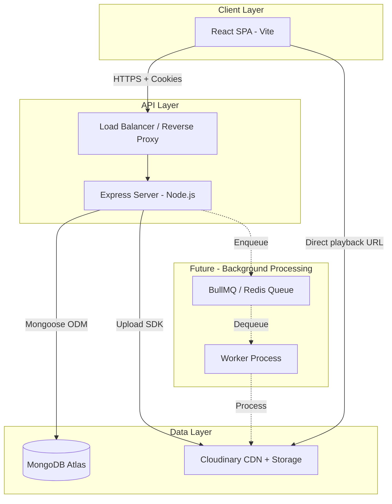
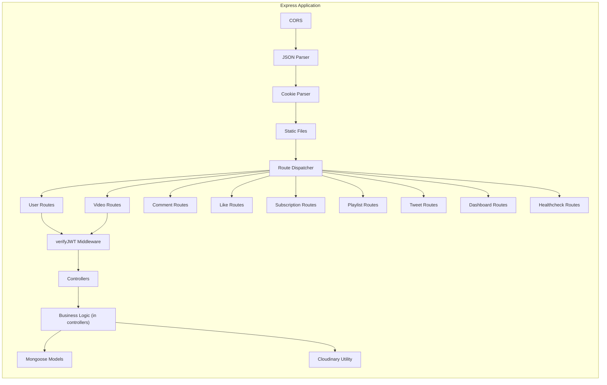
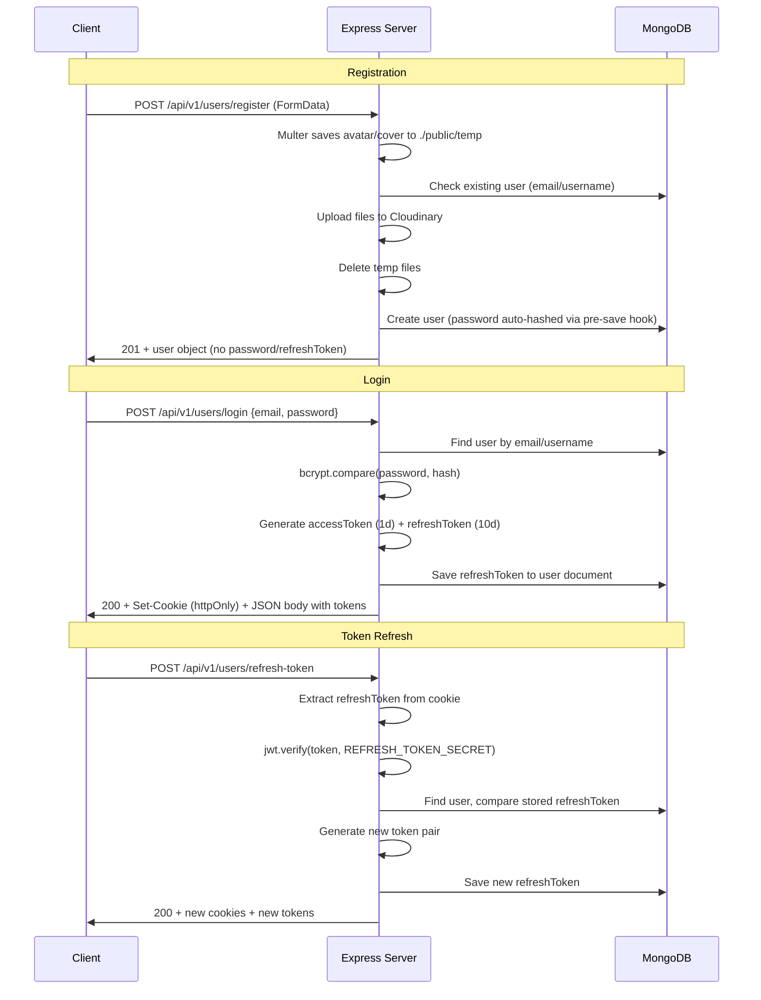
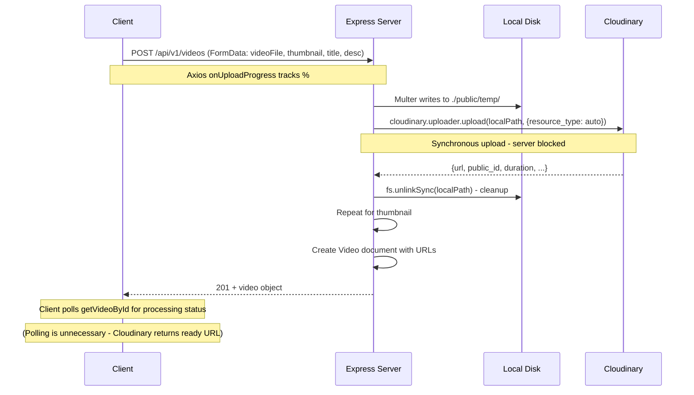
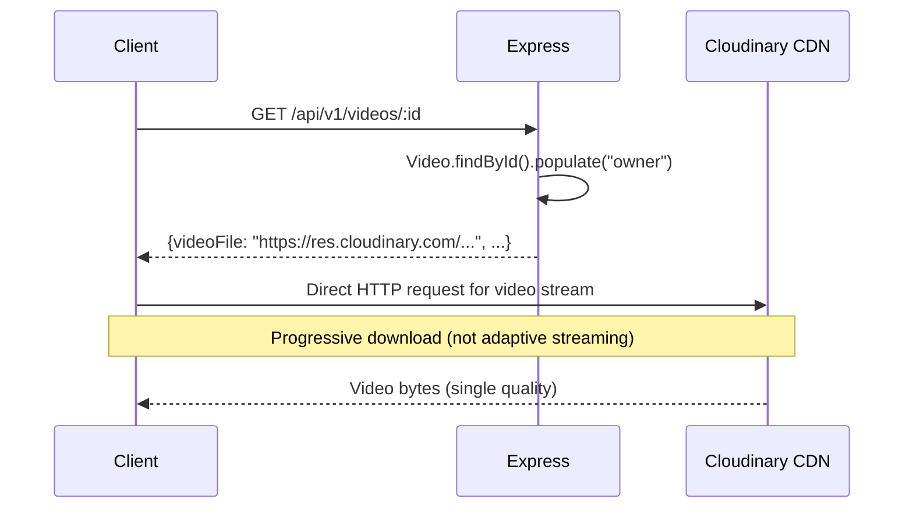
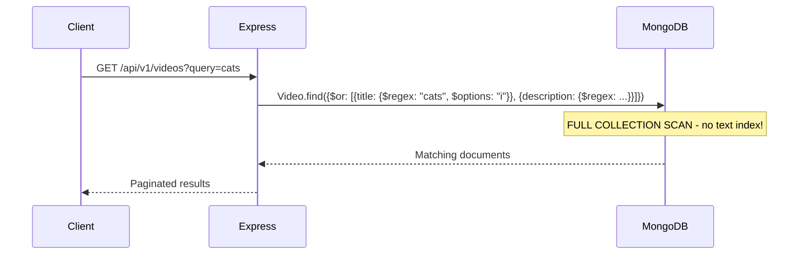
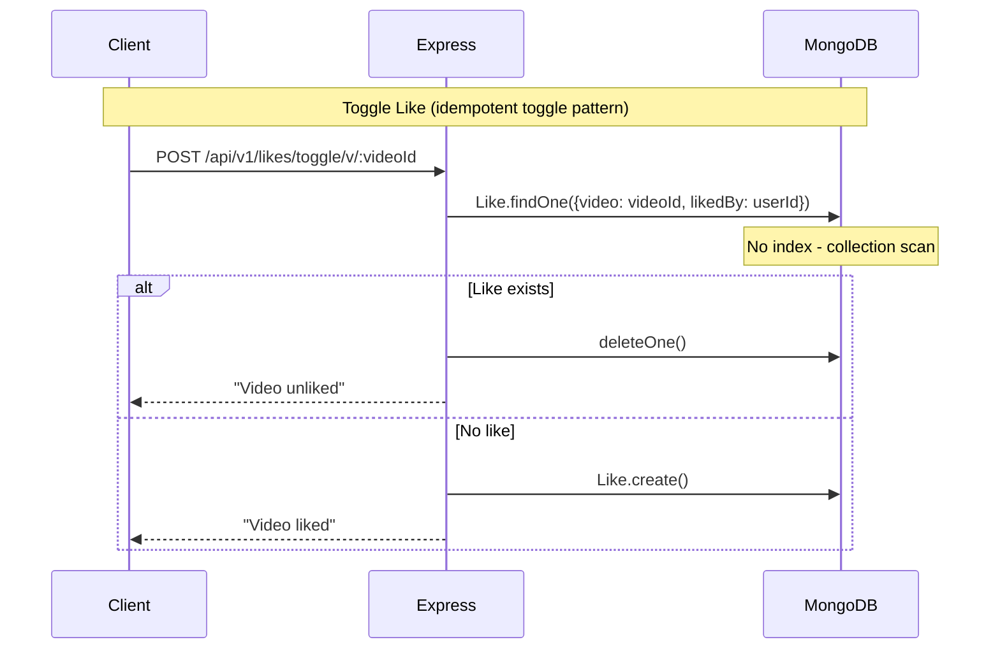
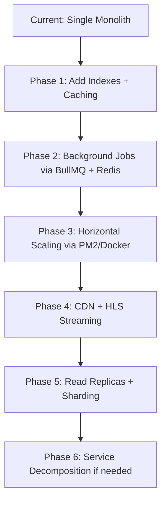

# Vidora Video Tube — Production Engineering Audit (Part 2)
## System Design Review

---

# 3. System Design Review

## 3.1 High Level Design (HLD)

**Current state:** The system is a classic 3-tier monolith (Client → API → DB + Storage). This is perfectly appropriate for the current scale and should NOT be changed to microservices.

## 3.2 Low Level Design (LLD)

## 3.3 Component Breakdown

| Component | Responsibility | Files | Issues |
|-----------|---------------|-------|--------|
| **Auth** | Register, login, logout, token refresh | `user.controller.js`, `auth.middleware.js`, `user.model.js` | Password logged to console, long token expiry |
| **Video CRUD** | Upload, list, search, update, delete | `video.controller.js`, `video.model.js`, `video.routes.js` | No file validation, client-trusted duration |
| **Engagement** | Likes, comments, subscriptions | `like.controller.js`, `comment.controller.js`, `subscription.controller.js` | No indexes, no pagination on some endpoints |
| **Playlists** | CRUD + add/remove videos | `playlist.controller.js`, `playlist.model.js` | `desciption` typo, no pagination |
| **Dashboard** | Channel stats | `dashboard.controller.js` | Expensive aggregation, no caching |
| **Tweets** | Community posts | `tweet.controller.js`, `tweet.model.js` | No pagination |
| **Media** | Upload → Cloudinary pipeline | `multer.middleware.js`, `cloudinary.js` | No type/size limits, folder param unused |

## 3.4 Request Flow Analysis

### Authentication Flow

**Issues identified:**
- Access token in BOTH cookie AND response body — the body copy can be stored insecurely by client
- No refresh token rotation validation window
- Access token `1d` expiry is too long

### Upload Flow

**Bottlenecks:**
1. **Synchronous upload blocks the event loop** — A 500MB video upload holds the Express worker for minutes
2. **No upload size limit** — Server can be OOM killed
3. **`resource_type: "auto"` accepts any file type** — Security risk
4. **No resumable uploads** — If connection drops at 99%, start over
5. **Duration trusted from client** — Should be extracted from Cloudinary response

### Playback Flow

**Issues:**
- No HLS/DASH adaptive streaming — single quality progressive download
- No CDN optimization beyond Cloudinary's built-in
- View increment is a separate API call (`POST /view/:videoId`) — could be abused

### Search Flow

**Fix:** Add text index on `title` and `description`, use `$text` operator instead of `$regex`.

### Feed / Recommendation Flow

**Current state:** There is NO recommendation system. `Home.jsx` fetches all videos sorted by `createdAt` descending. Every user sees the same feed.

### Comment / Like / Subscription Flow

**Issues:** No compound index on `{video, likedBy}` means every like toggle does a full collection scan.

## 3.5 Failure Scenarios and Fallback Behavior

| Scenario | Current Behavior | Correct Behavior |
|----------|-----------------|-------------------|
| MongoDB goes down | `process.exit(1)` on startup. No reconnection during runtime | Mongoose auto-reconnects. Add connection event handlers + health check |
| Cloudinary upload fails | Returns `null`, controller throws 500 | Should retry once, then return user-friendly error |
| Large file fills disk | Server crashes (no disk space) | Set multer `limits.fileSize`, use streaming upload |
| JWT secret missing | `jwt.sign` throws, 500 error | Validate env vars on startup, fail fast |
| Concurrent like toggles | Race condition — double likes possible | Add unique compound index |

## 3.6 Bottleneck Analysis

1. **Database queries without indexes** — Every `Like.findOne`, `Comment.find({video})`, `Video.find({owner})` is O(n)
2. **Synchronous Cloudinary uploads** — Express worker blocked during multi-minute video uploads
3. **Dashboard aggregation** — 3 separate DB queries + 1 aggregation for channel stats, no caching
4. **`$regex` search** — Full collection scan on every search query
5. **Unbounded `watchHistory` array** — Will hit 16MB document limit at ~1M entries
6. **No connection pooling config** — Default Mongoose pool size may not be optimal

## 3.7 Scaling Limits of Current Design

| Metric | Current Limit | Reason |
|--------|--------------|--------|
| Concurrent uploads | ~2-5 | Synchronous Cloudinary upload blocks event loop |
| Search latency | O(n) | `$regex` without text index |
| Like/Comment queries | O(n) | No compound indexes |
| User document size | ~16MB | Unbounded `watchHistory` array |
| API throughput | ~100-500 req/s | Single Node process, no clustering |
| Video delivery | No adaptive bitrate | Single quality progressive download |

## 3.8 Future Scaling Path

**Key principle:** Do NOT split into microservices until you have proven the monolith cannot scale further. For a video platform, the scaling bottleneck is almost always **media delivery** (solved by CDN), not application logic.
